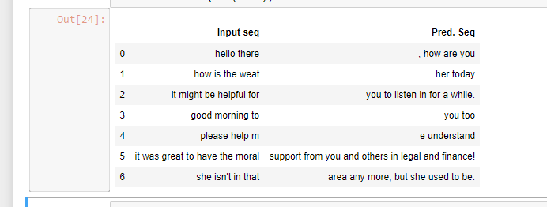

## Autocomplete Sentences

While typing in any email, it suggests you the next few words, completing the sentences. This is the objective of this project.
  
### Here is the demo of output :

 

  

### Implementaion

Run `python autocomplete_sentence.py --train Yes --file data/3_books.txt` to train and start predicting.
If you have already trained before and have the pretrained weights in "weights" folder, then run,
`python autocomplete_sentence.py --train No --file data/3_books.txt`

